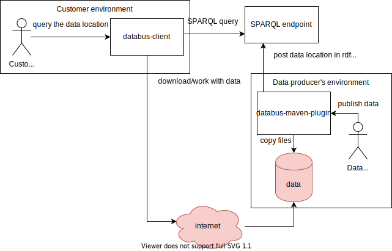
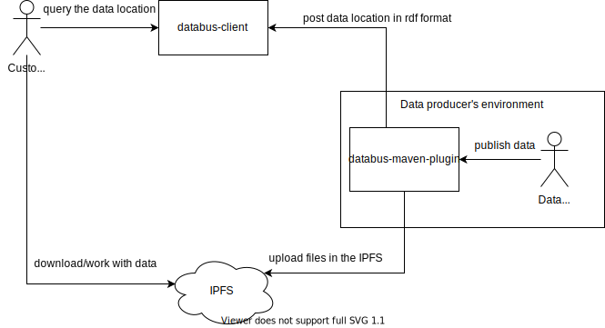

# Combine DBpedia/Databus with IPFS - Kirill Yankov

## Contact information

Name: Kirill Yankov  
Email Address: myworkpostbox [at] gmail.com  
My linkedin: https://www.linkedin.com/in/kirill-yankov-8b0747118/  
My github: https://github.com/manonthegithub  
  
## Project
Based on the "Combine DBpedia/Databus with IPFS" (https://forum.dbpedia.org/t/combine-dbpedia-databus-with-underlay/434)

### Project Description:
The project assumes implementaion of integration of Databus with IPFS. Databus (https://databus.dbpedia.org) is a service which allows people (or systems) to search for or publish data (knowledge graphs) for further processing. In current version, Databus does not store the data itself, but keeps links to the data. The data itself must be stored by the publishers themselves. Not all the publishers would like to keep the data themselves as well as to support the infrastructure for that, and it is where IPFS (https://ipfs.io/#why) can help.  
Integration of Databus with IPFS will allow publishers to publish the data in the IPFS, sparing the publishers from the need to maintain the infrastructure. On top of that, IPFS supports versioning of files, which makes it easier to publish new versions. For consumer that would also mean more reliability, because IPFS stores data in a distributed fashion without single point of failure.

### If you would be willing and able to work on another of our suggested project ideas instead, which ones?  
Maybe, in some similar projects.

### Please describe why you are interested in this specific project:  
The project has major challenges of making a good design, it is always interesting. Getting experience working with a distributed file storage (IPFS) is also very interesting. Scala is a big plus too.  

### Please describe a tentative project architecture or an approach to it:
Two main components:
 - databus-maven-plugin (https://github.com/dbpedia/databus-maven-plugin) - for publishing the data by customers
 - databus-client (https://github.com/dbpedia/databus-client) - loads published data, SPARQL endpoint
 
Current architecture:

(**Note** that there are many publishers, there is only one on the diagram for simplicity)

This needs more investigation on IPFS, but in general the project looks like implementation of publishing to and reading from IPFS via current databus components (databus-client, databus-maven-plugin). 

Possible architecture #1:

Possible architecture #2:

Main problems for uploading:
 - new mechanism of uploading most likely to be implemented (uploading files into IPFS)
 - versioning of the artifacts should be implemented (using IPFS)

Main problems for downloading:
 - downloading mechanism possibly needs to be changed (for example, if IPFS client library needs to be used)
 - potentially new gateway service needs to be implemented

### Please detail an expected project plan and timeline with milestones:  
Start of the work.
- look in more detail in the project code (both databus-maven-plugin and databus-client), get better understanding how it works (1-2 weeks). Getting a clear understading of how components work to be able to start modification.
- investigate on IPFS (1-2 weeks). Getting more information on the details of the IPFS api, its architecture and good practices of working with it.
- gather requirements (1 day - 1 week). This step is very important, as requirements need to be well defined and understood. This step involves the main risk of making the wrong solution.
- make initial design of integration with IPFS (2 days - 1 week) (both uploading and downloading). The architecture design is refined based on the information gathered in previous steps. Here may be some difficulties on picking the right architecture.
- make an initial prototype of the solution (1-2 weeks). Here should be a working application being able to publish versioned files in IPFS and download them from it.

Milestone 1. At that point re-estimation of implementation task size may be done.
- refine the solution requirements/architecture on the basis of collected from a prototype issues, drawbacks, comments (2 days - 1 week)
- implementation of the refined solution, with unit tests (2-6 weeks, difficult to assess, here is the main risk of underestimation). Incremental integration of the prototype into current solution modifying and/or creating new components. Here may be some difficulties with requirements on compatibility of the old solution with the new one.

Milestone 2.
- testing on some real data + integration (1-2 weeks). Deployment of the solution in the integration testing environment and testing it in more or less real world conditions (depending on your infrastructure, available resources etc.). Here some bugs/problems which need fixes may be revealed.
- documentation (1 week)
- spare time for bugfixes and unexpected obstacles (2 weeks)
- performance testing (1 week - 4 weeks)[optional] (In case we are doing gateway, performance can become an issue, it may be not enough time for improving, but possibly I can do it outside of the scope of the project. Peformance testing assumes modeling real word scenarios and emulation of them with performance testing tools. The main criteria is whether or not the solution can handle expected load (requests/files/bytes per second). I have experience in that, but it may be very time consuming.)

Final Milestone.

In the best case fully functional integration is implemented. In the worst case, there will be at least a working prototype.
<!--Please include in your plan how will you evaluate the performance of your contribution (in terms of time, or accuracy, or both), as well as which data sets you will use for that evaluation.-->

## Technical skills

Worked as a developer in industry. 3-4 years of experience in Java and 3-4 years more in Scala. Worked as a performance testing engineer. Basic Python, web-development (js, webpack, react).  
Oracle Certified Professional (Java 8).  
See example of code in "Open source" section.

## Open Source

My PRs: https://github.com/pulls?q=is%3Apr+author%3Amanonthegithub+archived%3Afalse+

Contributed and continue to several opensource projects: akka (latest big PR: https://github.com/akka/akka/pull/26825 - persistence testkit implementation), akka-http; small contributions to Apache JMeter, neosemantics (exporting rdf - to neo4j), java-stix, swagger-akka-http.  

### Why opensource? 
Firstly, opensource  helps you to grow as a professional, you can learn best practices and get inspiration for your projects from opensource. Secondly, sometimes I contribute to projects I use in my work, when its needed. Thirdly, its fun.

## Background & education

University of Freiburg. MS Computer Science. 2018 - now

## Research

Didn't do much of research. Had small project on investigating Neo4j performance on full Wikidata database imported in it (no publication). Cannot name any interesting paper.  
I would be interested in co-authoring a paper, if any.

## Summer plans

Initially the coding was expected to start on 18th of May, but as the timeline has changed, I have no overlapping activities anymore. I will be able to start working on the first few days with full dedication. At the beginning I was expecting that, when GSoC starts, I will be finishing my internship in Japan which is until the end of May.

## GSoC Experience
Did not participate in GSoC before.  

### Have you applied or do you plan to apply for any other 2020 Summer of Code projects? 
To increase the probability of being accepted I am applying for 3 projects.

### Why GSoC?
Great opportunity to learn more, get new aquaintances with great programmers, potentially find a job, contribute to opensource and to earn some money.  

### Why DBpedia? 
Three reasons: 
 - Interesting challenges (design of a working solution, integration with a distributed datastore)
 - I worked a little with rdf/ttl before, and it may be useful here
 - I love Scala, and its only project which is in Scala
 
## And finally...
Why me?
 - I think I can do a good job.
 - I love Scala.
